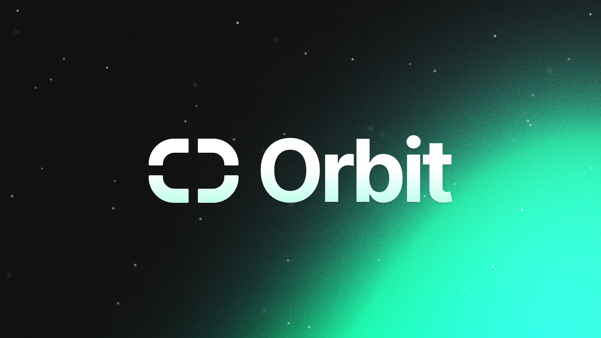

  

Orbit.rs is a set of independent utilities around NATS ecosystem that aims to
boost productivity and provide higher abstraction layer for NATS async rust client.
Note that these libraries will evolve rapidly and API guarantees are
not made until the specific project has a v1.0.0 version.

# Utilities

This is a list of the current utilities.

| Module | Description                                   | Docs                        |
| ------ | --------------------------------------------- | --------------------------- |
| nats extra   | Set of useful tools for Core NATS | [README.md](nats-extra/README.md) |
